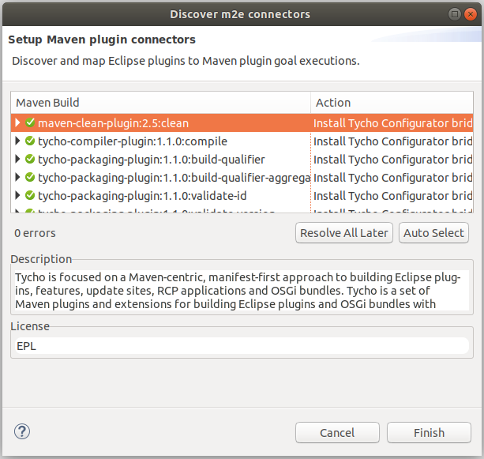
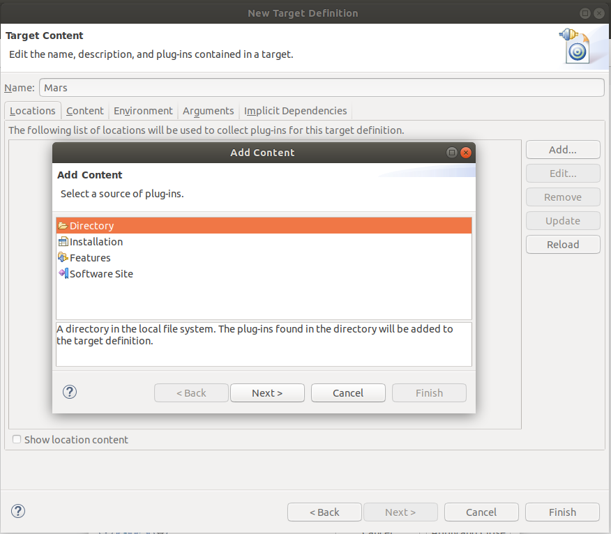

# Running the Analysis Platform form Sources

This is a quick start guide to get the SCAVA platform running from source with Eclipse.

## Prerequisite

### Install MongoDB

You can download MongoDB from the [MongoDb website](http://www.mongodb.org/downloads).

### Install EclipseIDE

Although these instructions may apply to other versions of Eclipse IDE, they were tested under Eclipse Neon.3 with plug-in development support (Eclipse IDE for RCP Developers package).

## Get the Code

Get the latest version of the code, and checkout the `dev` branch. Please don't commit to the `master` branch: see the [Development Guidelines](../../contributors-guide/contributors-guidelignes/scava-developement-process.md#source-code-repository):

If you are using __Linux / OS X__:
````Shell
git clone https://github.com/crossminer/scava.git scava
cd scava
git checkout dev
````

If you are using __Windows__ you need to do things differently due to Windows' long file name limit. In the Git shell:
````Shell
mkdir scava
cd scava
git init
git config core.longpaths true
git add remote origin https://github.com/crossminer/scava.git
git fetch
git checkout dev
````

## Configuration

### Configure The Eclipse IDE
#### Import Projects into Eclipse Workspace

Open Eclipse and import all projects from the top level directory of the Scava code (`File -> Import -> Maven -> Existing Maven Projects`), and wait for all the projects to compile without errors.

Meanwhile, the Eclipse IDE would suggest you to install a set of m2e-connectors including 
[Tycho Plugin](https://www.eclipse.org/tycho/).
<br/>
<br/>

Figure-01: Install m2e-connectors plugins.

#### Configure the Target Platform

The Scava Analysis Platform is based on the Mars version of the RCP Eclipse. In order to run the platform in a newer eclipse environment, you will have to download the Eclipse Mars platform and configure it as Target Platform.

* **Download Eclipse Mars platform**
Download the compleate Eclipse Mars platform.

In command ligne :

````Shell
./eclipse -nosplash -verbose -application org.eclipse.equinox.p2.metadata.repository.mirrorApplication -source http://download.eclipse.org/releases/mars -destination {your platform folder}
````

````Shell
./eclipse -nosplash -verbose -application org.eclipse.equinox.p2.artifact.repository.mirrorApplication -source http://download.eclipse.org/releases/mars -destination {your platform folder}
````
Then, extract the its context somewehere on your machine.

* **Download Rascal dependencies**

Download two external libraries required to run metrics providers based on Rascal.

Repository URL : [Rascal Dependencies](https://update.rascal-mpl.org/unstable/plugins/)

1.  impulse_0.3.0.xxx.jar
1.  rascal_eclipse_0.12.0.xxx.jar

* **Configure the Target Platform**

Open the Eclipse preferences on (`Window -> Preferencies`), then choose the Target Platform Definition (`Plug-in Development -> Target Platform`).<br/>
<br/>
Figure-02: Eclipse Preferences.

Add a new Target Platform configuration for the project, choose the Default initialization then click on (`Next`).<br/>
<br/>
Figure-03: Eclipse Target Platforms Initialization.

Give a name to the new target platform, hit the (`Add`) button to add the Eclipse Mars dependencies and the external rascal libraries content to the target, then click on (`Finish`).<br/>
<br/>
Figure-04: Eclipse Target Platforms Dependencies.

Finally, check the new target Configuration, then click on (`Apply and Close`) to save the changes.<br/>
<br/>

Figure-05: Eclipse Target Platforms.

### Configure the Analysis Platform

#### `identifier=<your name>` 
The identifier of the node. If not specified, the platform will attempt to use the node's hostname, and if it cannot resolve the hostname, it will generated a random UUID. 

If you plan to multiple instances of the platform on the same machine, you should definitely specify different node identifiers.

#### `log.type=console|file|rolling`
You can specify whether to log output to the console (Log4J's ConsoleAppender), to a particular file without a size limit (Log4J's FileAppender), or to a different file per day (Log4J's DailyRollingFileAppender). If you specify `file` or `rolling`, you must complete the `log.file.path` or `log.rolling.path` property as well. 

If the property is not specified, it will default to the console logger.

#### `log.file.path=<path>`
The path to the file to store the log. E.g. `log.file.path=/tmp/lovelylog.log`

#### `log.rolling.path=<path>`
The path to the file to store the log. This is a Log4J DailyRollingFileAppender that will create separate logs for each 12 hours of the day. The date stamp will be appended to the path provided. E.g.: if you specify `log.rolling.path=/tmp/mylovelylog.log`, it will store files like so: `/tmp/mylovelylog.log.2014-12-17-00` and `/tmp/mylovelylog.log.2014-12-17-12`.

#### `maven_executable=<path>`
The path to where Maven is installed. E.g. `maven_executable=/usr/bin/mvn`

#### `storage_path=<path>`
The path to where files should be stored. E.g. `storage_path=/mnt/ossmeter/`

#### `mongo_hosts`
A comma-separated list of the hosts and ports in a replica set. E.g. `ua002:27017,ua009:27017,ua019:27017,ua020:27017`


## Run the Analysis Platform

### Start MongoDB

Instructions for starting mongo can be found in the MongoDB [manual](http://docs.mongodb.org/manual/). For example:

````Shell
sudo systemctl start mongod
````
or
````Shell
sudo service mongod start
````

## Run the api-gateway

  * Right click on
`scava-api-gateway/src/main/java/org.eclipse.scava.apigateway/ApiGatewayApplication.java`
  * Then click on Run As -> Java Application

## Run the authentication service

  * Right click on
`scava-auth-service/src/main/java/org.eclipse.scava.authservice/AuthServiceApplication.java`
  * Then click on Run As -> Java Application

### Validate and Run the Platform

Open `releng/org.eclipse.scava.product/scava.product`
  * Click the `Validate...` icon in the top right of the product configuration editor (the icon is a piece of paper with a tick)
  * If things do not validate, there's something wrong -- get in touch :) Problems related to `org.eclipse.e4.core.di` aren't critical.
  * Then, click the `Export an Eclipse product` on the left of the `Validate...` button. Uncheck the `Generate p2 repository` checkbox, select a destination directory and validate. After a while, the SCAVA platform will be generated in the selected directory.
  * The platform can then be run using the generated `eclipse` binary; it accepts the following arguments:
    * `-apiServer`: Starts up the client API on localhost:8182
    * `-worker ${id-worker}`: Spawns a thread that analyses registered projects
  * To get a full platform running, first launch a worker thread, then the API server.

When starting the platform, you can pass a configuration file to control the behaviour of the platform:

````Shell
./eclipse -worker ${id-worker} -config myconfiguration.properties
````

