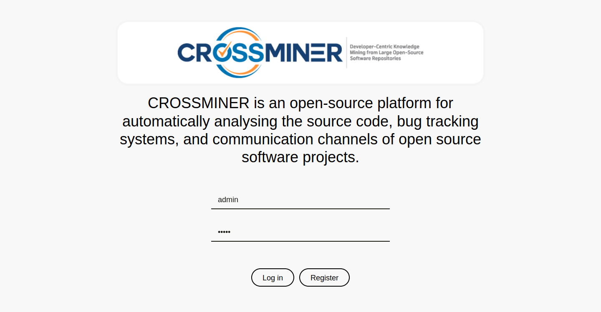
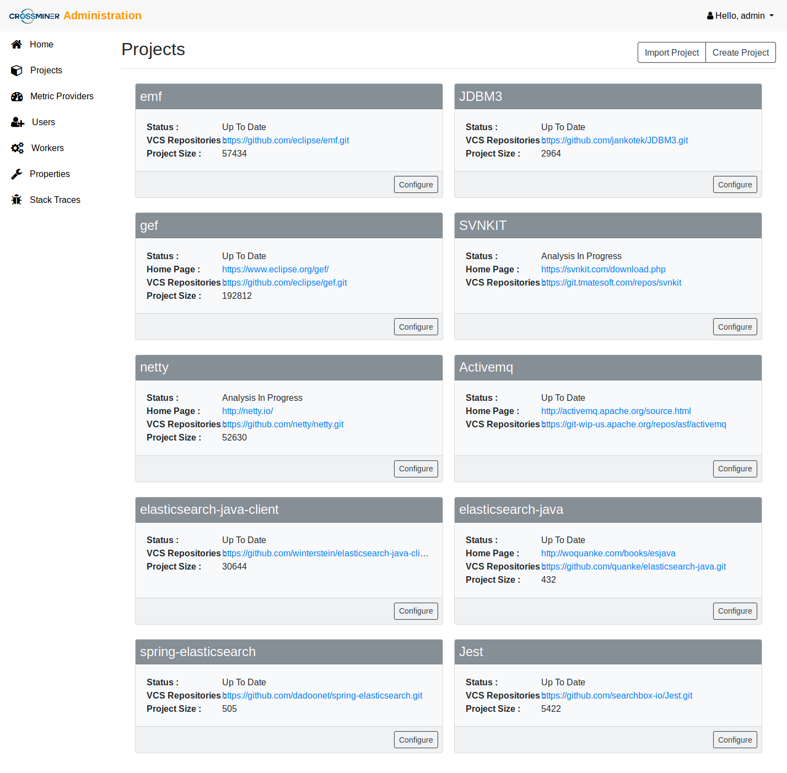
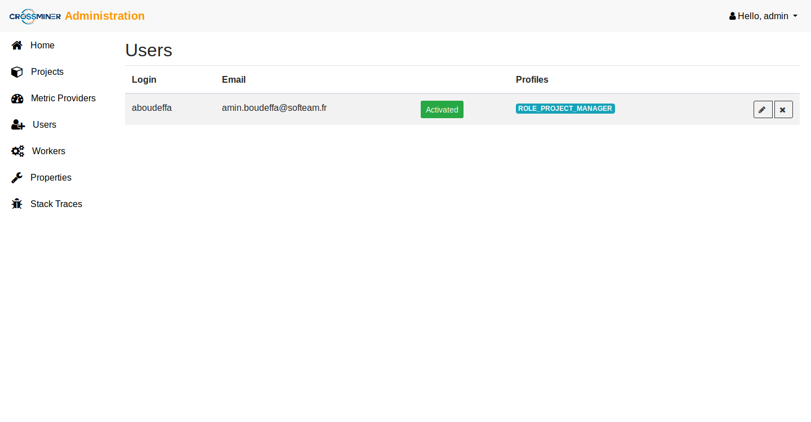
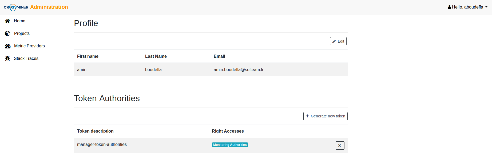
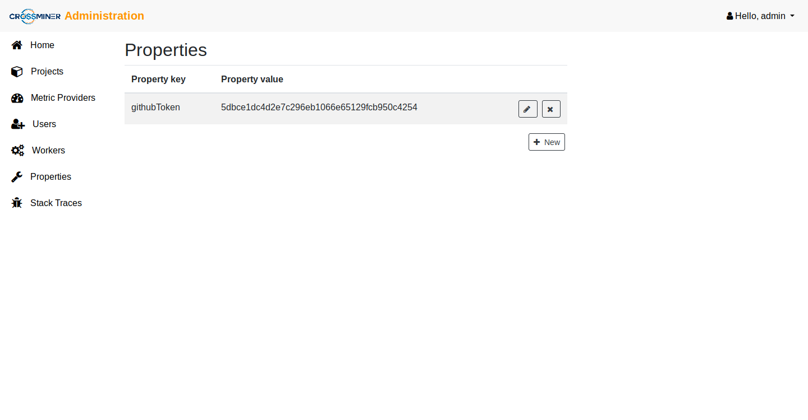

# Platform Administration User Guide
The guide show up the different features available through the Administration Dashboard, including:
* The Login feature
* The Projects management feature
* The Users management feature
* The Workers feature
* The Properties management feature
* The Stack Traces feature

### The Login feature
The first time the user access the administration dashboard, a login form will be shown in order to authenticate the associated user.

### The Projects management feature
The Projects view displays the list of the OSS projects downloaded from the OSS forges.

The administration dashboard provides two operations:
* Import Project: 
If your project is hosted on an OSS forge, you can simply paste the URL on the field and add it.

* Create Project:
The second operation provides an extra-options to customize the project creation alongside to the metadata available from differents related sources, eg., communication channels and bug tracking systems.

Once the project has been registred, it's possible to configure inside it some analysis tasks. An analysis task is consist of:
* Label name: the analysis task name.
* Task type: the scheduling tasks execution mechanism which could be:
  * Single Execution: which allows to execute
 a task between a start date and an end date.
  * Monitoring Execution: which permits to run a task from a start date until the current date then to schedule the task execution each new day.
* Start date: the start time range of the analysis process.
* End date: the end time range of the analysis process.
* Metric Providers: the metrics available on the metric-platform through the extension points mechanism.

These tasks will be executed later to compute/calculate some metrics that will be used to measure the quality of the OSS projects during various period of time.

### The Users management feature
The Users view allows to manage the differents users of the the administration dashboards. It provides three levels of roles:

* USER ROLE: The user profile is enable to shows up the basic administration dashboard features including:
  * Show up the list of registred projects.
  * Show up the analysis tasks status.
  * Show up the list of metric-providers.
  * Manage its own token authorities.
  * Show up the stack traces.
* PROJECT MANAGER ROLE: The project manager profile is enable to manage the main administration dashboard features including:
  * Import/create new projects.
  * Show up the list of registred projects.
  * Manage new analysis tasks.
  * Show up the analysis tasks status.
  * Show up the list of metric-providers.
  * Manage its own token authorities.
  * Show up the stack traces.
* ADMIN ROLE: The admin profile is the super-user of the admin-ui which is enable to get access to almost all the features come with the administration dashboard, including:
  * Import/create new projects.
  * Show up the list of registred projects.
  * Manage new analysis tasks.
  * Show up the analysis tasks status.
  * Show up the list of metric-providers.
  * Manage the admin-ui users and their roles.
  * Monitor the workers and theirs analysis tasks.
  * Manage configuration properties.
  * Show up the stack traces.

#### The profile view
Both the user and the project manager profiles have the ability to edit its own account and manage the token authorities related the Eclipse Integrated Development Environments (IDEs) component. The generated token authorities is assigned and available only on current profile.

### The Workers feature
The workers view is dedicated to the dashboard administrators which allows them to monitor the status of the analysis tasks processes of the metric-platform. The Platform Workers section shows up the workers with theirs assigned analysis tasks. The Pending Tasks presents the analysis tasks waiting for a free worker.

### The Properties management feature
The Properties feature allows to configure generic configurations applied to the metric-platform, eg., Github OAuth tokens.

Among the properties that can be set, we can name:
* GitHub
   * Token githubToken
* GitLab
   * Token: gitlabToken
* Eclipse (both elements mandatory if an authenticated connection want to be used )
   * ClientID: eclipseClientId
   * ClientSecret: eclipseClientSecret

### The Stack Traces feature
The Stack traces feature allows to display the errors/stracktraces produced during the metric-platform analysis process in the admin UI to ease debugging.

