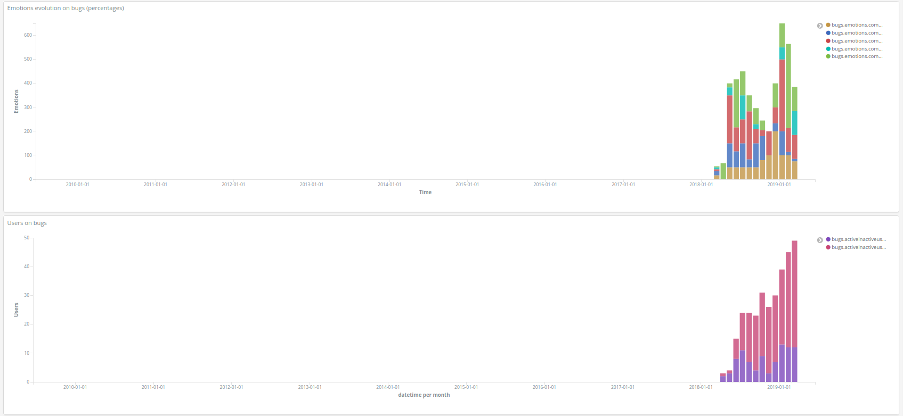
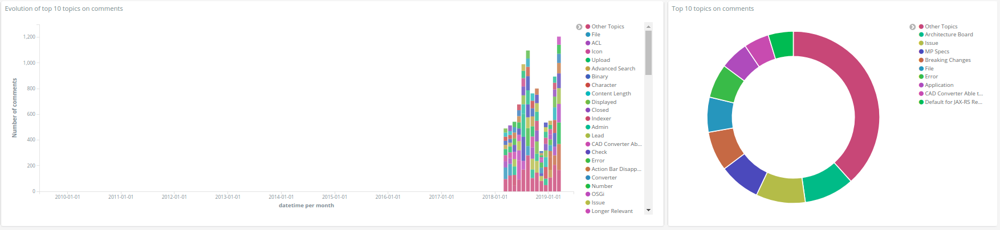
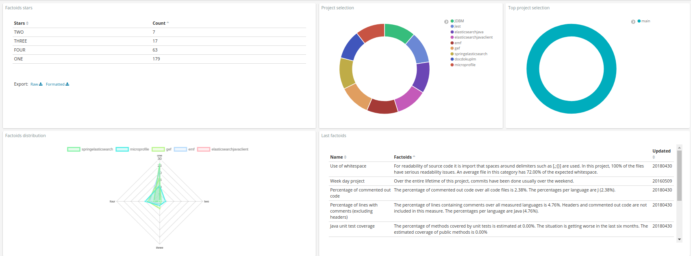
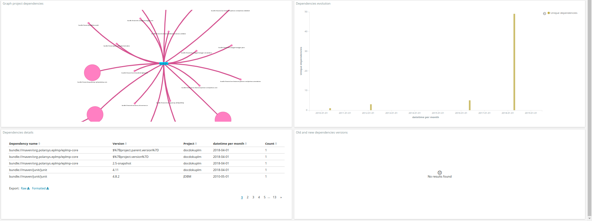
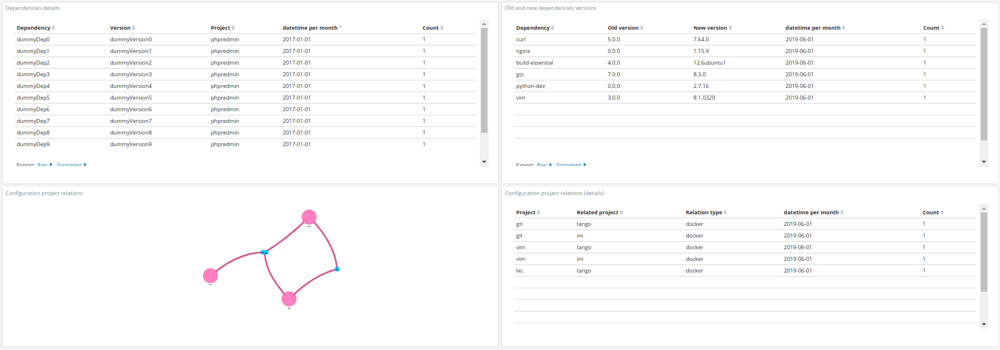
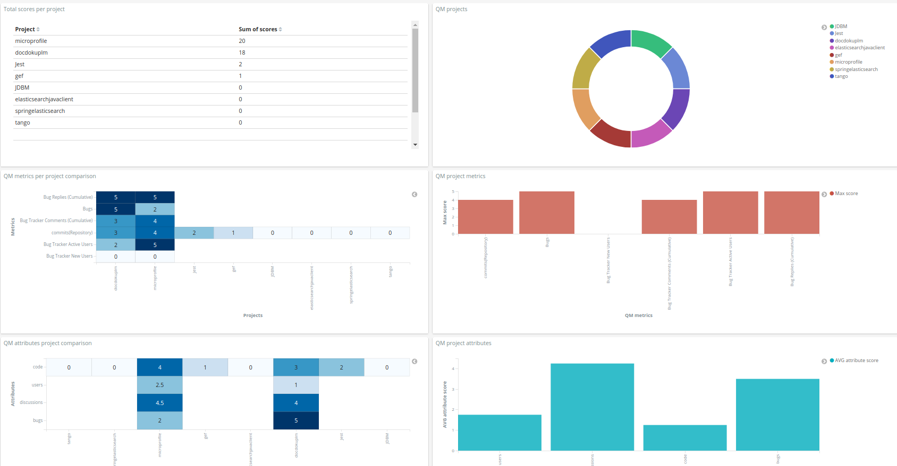
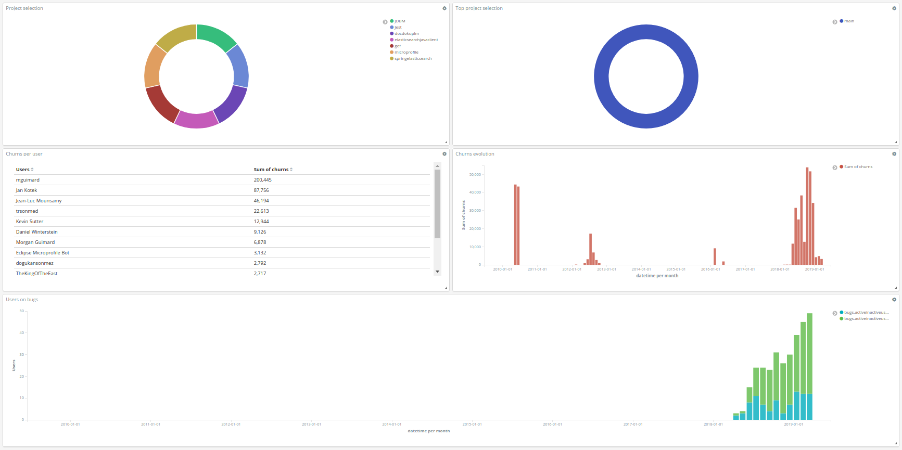
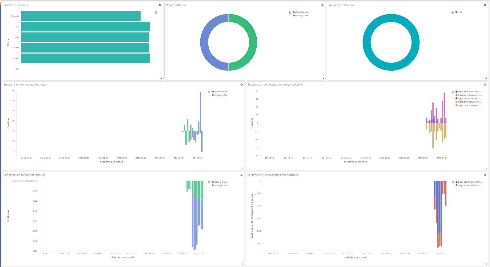

# Visualisation Dashboard

This guide describes the different dashboards that are available with the platform.

## Project Dashboard (dev/debug)
The Project Dashboard (dev/debug) shows all the metrics available in CROSSMINER, fetched from the SCAVA API. It displays the global value and the evolution in time of the metrics. It includes also filters to ease the analysis of a specific group of metrics. The dashboard is composed of different tables and visualizations, the tables show some statistics on the metrics (e.g., number of metrics per type, name and project), while the visualizations plot the average, sum and max values for every snapshots of a given metric.

The Project Dashboard (dev/debug) allows to understand the SCAVA metrics in terms of global and time values. A screenshot of the dashboard is shown below, as can be seen, the tables on the left contain global values, while the visualizations on the right allow to understand the metrics evolution. Finally, the last row of the dashboard shows different numeric values as a result of applying different metrics to the metric values. 

## Overview dashboard

The Overview dashboard, starting from top to bottom and from left to right, includes the following visualizations:

First of all, there is a table that shows the list of last facts. Then there are two "selection" pies, a pie chart that shows the projects. It can be used to filter by project and a pie chart that shows the top projects. It can be used to filter by top project. To follow, there is a table with the last recommendations (they come from the trans.rascal.OO metrics) and a heat map that allows to compare the projects wrt to attributes of the quality model defined [in prosoul](https://github.com/Bitergia/prosoul/blob/master/django-prosoul/prosoul/data/qmodel_crossminer.json). Then, there is a table that shows the similar projects in terms of recommendation, it describes if it's active, the type and the number of recommendations. The next row shows a bar chart that shows the evolution of bugs (fixed vs closed/non resolved) and another bar chart that shows the evolution of commits. The next two rows show two bar charts as well, starting with a bar chart that shows the evolution of percentage emotions (anger, joy, sadness, surprise, love) in bugs and a bar chart that shows the evolution of active and inactive users on bug tracker. Finally, the last row includes information about a pie chart and a bar chart that show the top 10 topics on comments and their evolution. 

The figures below show an example of the dashboard:

## Factoids dashboard
The Factoids dashboard, starting from top to bottom and from left to right, includes the following visualizations in order to understand the factoids that are in the projects:

The first table shows the number of projects that have from one to four factoids and the next two "selection" pies in order to filter the dashboard by project or top project if it is required. The following radar shows an overview of the project and how the number of factoids are distributed on them, the table shows the last factoids added.
The following three heat maps show different specific factoids with the projects, grouped them by bugs, commits and code quality. The last large heat map shows all the projects and all the factoids with the corresponding values.

The figures below show an example of the dashboard:

## Dependency dashboard

This Dependency dashboard is useful to show the dependecies. It contains the following visualizations/tables (from left to right, top to bottom):

It starts with a visualization that shows the number of total deps and two pie charts, the first one is a pie chart that shows the deps grouped by project and the second one is a pie chart that shows the deps grouped by top project. Then, there are two tables, one that shows the deps grouped by type (e.g., osgi and maven) and project and other table that shows the deps grouped by type and top project. Below the tables, there is a graph that relates projects to dependency names and a bar chart that shows the evolution of project deps. To finish the dashboard has a table that provides details (name, versions, project and datetime) of the project deps and a table that shows the old and new version of each dependency.

The figures below show an example of the dashboard:

## DevOps dependencies Dashboard

The Devops Dependencies dashboard, starting from top to bottom and from left to right, includes the following visualizations in order to understand the devops dependencies that are included in the project:

First of all, it has a pie chart that shows the deps grouped by project, it has also a pie chart that shows the deps grouped by top project, these two pies can be used to filter the dashboard. then there are two tables, the first one shows the deps grouped by type (e.g., puppet and docker) and project, and the second one shows the deps grouped by type and top project. Below the tables, there is a graph that relates projects to dependency names and a bar chart that shows the evolution of project deps. Then, there are two tables, the first one provides details (name and versions) of the project deps and the second one shows the old and new version of each dependency. To finish, there is a graph that shows the relation between projects that are using configuration files, the relation can be derived from Puppet or Docker, the table shows the type of relation in addition.

The figures below show an example of the dashboard:

## DevOps smells dashboard
The DevOps smells dashboard includes two visualizations to focus on a specific project and/or top project. Two bar charts show the evolution of the smells extracted from puppet and docker. They rely on the following historic metrics:
- puppet.designsmells.smells
- puppet.implementation.smells
- docker.smells

Two tables allow to focus on the smells details. The former shows information about design and configuration smells, while the latter gives insights about antipatterns smells. Both of them have the information of the file and the line.

The figures below show an example of the dashboard:

## Quality model dashboard

The Quality model dashboard shows the quality model assessment based on the model available [in prosoul repo](https://github.com/Bitergia/prosoul/blob/master/django-prosoul/prosoul/data/qmodel_crossminer.json)

It starts with a table that ranks the projects based on the sum of their scores, which are the normalized values (0-5) of the metrics based on the threshold defined in the quality model and a pie chart that shows the projects. It can be used to filter by project. Then there is a heat map that allows to compare projects based on the qm metric scores and a bar chart that shows the qm metric scores (useful to focus on one project). Following, it has a heat map that allows to compare projects based on the qm attributes (median of the corresponding metric scores) and a bar chart that shows the qm attributes (useful to focus on one project). It continues with another heat map that allows to compare projects based on the qm goals (median of the corresponding metric scores) and a bar chart that shows the qm goals (useful to focus on one project). To finish, there are three bar charts that show the evolution in time of the quality models by quarters.

The figures below show an example of the dashboard:

## Users dashboard

The Users dashboard is useful to show user activity. It contains the following visualizations/tables (from left to right, top to bottom):

First, it has two pie charts, a pie chart that shows the projects (it can be used to filter by project) and a pie chart that shows the top projects (it can be used to filter by top project). Then, there is a table that shows the top users based on the sum of their churns and a bar chart that shows the churn evolution (it can be filtered by user). To finish, there is a bar chart that shows the evolution of active and inactive users on bug tracker.

The figure below shows an example of the dashboard:

## Sentiment and emotion dashboard

The Sentiment and emotion dashboard includes 2 visualizations to select a project and top project, a visualization that summarizes the number of emotions, 2 visualizations that show the emotion trend per project based on weighted values and the corresponding details, 2 visualizations that show the sentiment trend per project and details about the sentiment at the beginning and end of the threads.

The figure below shows an example of the dashboard:

