# Install the CROSSMINER plug-in
Install the latest version of the CROSSMINER plug-in from the update site:

<http://ci5.castalia.camp:8080/job/scava-ide/job/dev/lastSuccessfulBuild/artifact/eclipse-based-ide/org.eclipse.scava.root/releng/org.eclipse.scava.update/target/repository>

# Configuration
- Once the plug-in is installed and the workbench restarted, open the Eclipse Preferences wizard and select the left item **CROSSMINER > Remote settings**
- For the knowledge base server specify either  http://83.212.75.210 or http://scava-dev.ow2.org
- For the port, for both servers, indicate: 8080

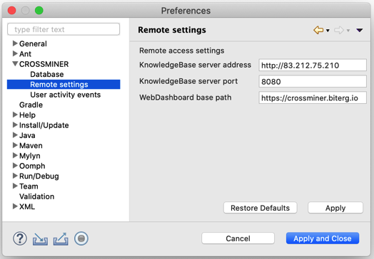

# Getting started scenario

A professor requests his students to extract the current weather for a given city from the **OpenWeather** <https://openweathermap.org> open data site. The data provided are in a JSON format. For example, for "Paris, FR"
<http://api.openweathermap.org/data/2.5/weather?q=Paris&appid=abbcea2020f75409af198b98de40e3a6>.

# Task 0: Import a library
## Look for a JSON parser library
Look for using CROSSMINER > Project search > Find JSON parser projects.
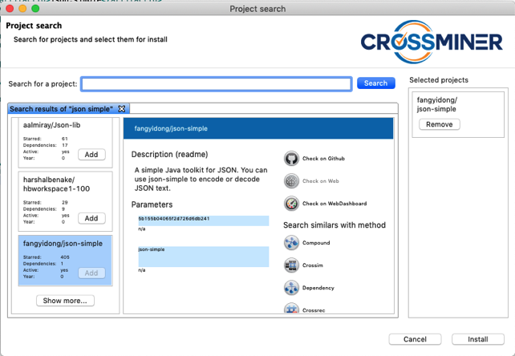

The developer can choose how to import the selected library in the project that he is implementing once a possible library has been selected. We presented two ways to import a library as:
- an Eclipse project and
- a Maven dependency.

We suggest importing the libraries as maven dependencies because it enables more recommendations. For instance, a recommender provides the list of update library. Moreover, the recommender system suggests useful missing libraries.

## Import it as an Eclipse project
Select the json-simple projects and clone it.

**Please manually remove “\” from the project folder name after it has been cloned. FEA is going to push a fix that solves this issue.**

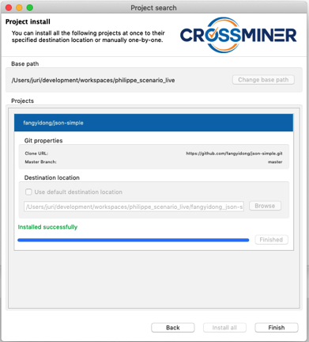

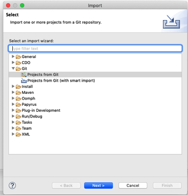

Add the downloaded project into the classpath.

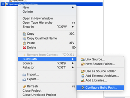

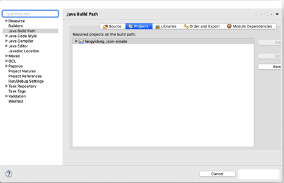

## Import it as a Maven dependency
An interested developer can discover that JSON-simple is available as a Maven dependency by inspecting the GitHub pages.

In this case json-simple library can be imported as a Maven dependency.
- Create a new Eclipse project named **openweather.json-simple**
- **Configure > Convert to Maven project** the created project

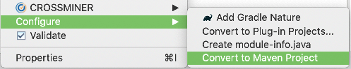
- Open the **pom.xml** file
- From the **Dependencies** tab, add a new dependency on **json-simple**:

- The **pom.xml** file should look like that after the changes have been accepted:

	<project xmlns="http://maven.apache.org/POM/4.0.0" xmlns:xsi="http://www.w3.org/2001/XMLSchema-instance" xsi:schemaLocation="http://maven.apache.org/POM/4.0.0 http://maven.apache.org/xsd/maven-4.0.0.xsd">
	  <modelVersion>4.0.0</modelVersion>
	  <groupId>openweather</groupId>
	  <artifactId>openweather.json-simple</artifactId>
	  <version>0.0.1-SNAPSHOT</version>
	  <build>
	    <sourceDirectory>src</sourceDirectory>
	    <plugins>
	      <plugin>
	        <artifactId>maven-compiler-plugin</artifactId>
	        <version>3.8.0</version>
	        <configuration>
	          <source>1.8</source>
	          <target>1.8</target>
	        </configuration>
	      </plugin>
	    </plugins>
	  </build>
	  <properties>
	  	<project.build.sourceEncoding>UTF-8</project.build.sourceEncoding>
	  </properties>
	  <dependencies>
	  	<dependency>
	  		<groupId>com.googlecode.json-simple</groupId>
	  		<artifactId>json-simple</artifactId>
	  		<version>1.1.1</version>
	  	</dependency>
	  </dependencies>
	</project>

# Task 1: Extract the current weather from the OpenWeather API

## Look for JSON API StackOverFlow recommendations
- Create a Class with its main method.
- Add the code instantiating the JSON parser

	package openweather.json_simple;
	
	import org.json.simple.parser.JSONParser;
	
	/**
	 * Parse Open Weather API
	 *
	 */
	public class App {
		public static void main(String[] args) {
			JSONParser parser = new JSONParser();
		}
	}

- Select the whole code and, in the contextual menu, ask for relevant Q&A post recommendations.

>	The recommendation query is based on the selected code and more particularly on:
>	
>	- Import Declaration: The directives used to invoke libraries
>	- Method Declaration: Method declarations with parameters
>	- Method Invocation: API function calls
>	- Variable Type: Types of all declared variables
>	- Variable Dec: All declared variables
>	- Class Instance: Class declarations

- The recommender provides related StackOverflow posts. The recommendations are useful to learn how to use the selected json-simple recommendation. A new view is displayed below the code with a list of related posts:

>These posts come from a filtering (only questions with answers, only question with java code,...) and indexing of more than 18 millions StackOverFlow posts. 

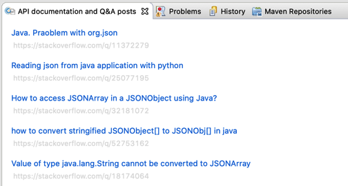

- The provided links are: 

	- [Java. Praoblem with org.json](https://stackoverflow.com/questions/11372279/java-praoblem-with-org-json)
	- [Reading json from java application with python](https://stackoverflow.com/questions/25077195/reading-json-from-java-application-with-python)
	- [How to access JSONArray in a JSONObject using Java?](https://stackoverflow.com/questions/32181072/how-to-access-jsonarray-in-a-jsonobject-using-java)
	- [how to convert stringified JSONObject[] to JSONObj[] in java](https://stackoverflow.com/questions/52753162/how-to-convert-stringified-jsonobject-to-jsonobj-in-java)
	- [Value of type java.lang.String cannot be converted to JSONArray](https://stackoverflow.com/questions/18174064/value-of-type-java-lang-string-cannot-be-converted-to-jsonarray)

- These different posts, e.g. [How to access JSONArray in a JSONObject using Java?](https://stackoverflow.com/questions/32181072/how-to-access-jsonarray-in-a-jsonobject-using-java), provides a good example which can help understand the JSONParser core APIs:

At this point the code looks like that:

	package openweather.json_simple;
	
	import java.io.BufferedReader;
	
	import org.json.simple.JSONArray;
	import org.json.simple.JSONObject;
	import org.json.simple.parser.JSONParser;
	
	/**
	 * Parse Open Weather API
	 */
	public class App {
	
		public static void main(String[] args) throws IOException, ParseException {
			BufferedReader reader = null;
			// Parsing of the API result
			JSONParser parser = new JSONParser();
			JSONObject jsonObject = (JSONObject) parser.parse(reader);
			// Access the JSON object
			String cityName = (String) jsonObject.get("name");
			JSONArray array = (JSONArray) jsonObject.get("weather");
		}
	}

## Look for JSON API snippet code recommendations
If we look again for StackOverFlow recommendations to understand how to handle a JSONArray, we don’t get useful post.
So let's try with another recommender.

- Select the whole code and, in the contextual menu, ask for code recommendation.

- This new feature opens a view named Code Recommendation and lists some examples of code snippets extracted from the knowledge base. 
- For the current code, we obtain one single code snippet. This snippet is quite useful, it shows a good example of how parsing the JSONArray

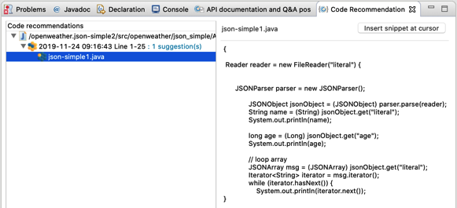

- Based on this, we can conclude the parsing of the JSON result by iterating across the JSONArray:

    // loop array 
    JSONArray array = (JSONArray) jsonObject.get("weather");
    Iterator<JSONObject> iterator = array.iterator(); 
    JSONObject weather;
    while (iterator.hasNext()) { 
            weather = (JSONObject)iterator.next();
            String description = (String)weather.get("description");
            System.out.println(cityName+": "+description);
        }
Finally, at this point, our code looks like that:

	package openweather.json_simple;
	
	import java.io.BufferedReader;
	import java.io.IOException;
	import java.util.Iterator;
	
	import org.json.simple.JSONArray;
	import org.json.simple.JSONObject;
	import org.json.simple.parser.JSONParser;
	import org.json.simple.parser.ParseException;
	
	
	/**
	 * Parse Open Weather API
	 */
	public class App {
	
		public static void main(String[] args) throws IOException, ParseException {
			BufferedReader reader = null;
			// Parsing of the API result
			JSONParser parser = new JSONParser();
			JSONObject jsonObject = (JSONObject) parser.parse(reader);
			// Access the JSON object
			String cityName = (String) jsonObject.get("name");
			// loop array 
			JSONArray array = (JSONArray) jsonObject.get("weather");
			Iterator<JSONObject> iterator = array.iterator(); 
			JSONObject weather;
			while (iterator.hasNext()) { 
				weather = (JSONObject)iterator.next();
				String description = (String)weather.get("description");
				System.out.println(cityName+": "+description);
			}
		}
	}

## Access REST API result
It’s time to implement the getCityWeatherReader method accessing to the the Open Weather REST API.
- Let’s start with the creation of the REST API URL. Before calling any recommender, the code looks like that:

	public class App {
		static String OpenWeathermapAPI = "http://api.openweathermap.org/data/2.5/weather?q={city}&appid= {appid}";
		static String AppId = "abbcea2020f75409af198b98de40e3a6";
	
		public static void main(String[] args) throws IOException, ParseException {
			// Creation of the REST API
			String city = (args.length != 0)? args[0]:"Toulouse";
			String restAPI = OpenWeathermapAPI.replace("{city}", city);
			restAPI = restAPI.replace("{appid}", AppId);
			URL url = new URL(restAPI);
			// Call the  REST API
			HttpURLConnection connection = (HttpURLConnection)url.openConnection();

- Select the code for the top of the file to the openConnection call

- Again, the StackOverFlow recommender doesn’t provide pertinent post. On the other hand, the Code Recommender provides an interesting code snippet:

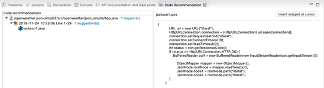

Based on this, we can complete our code. Finally the code looks like that:

	package openweather.json_simple;
	
	import java.io.BufferedReader;
	import java.io.IOException;
	import java.io.InputStreamReader;
	import java.net.HttpURLConnection;
	import java.net.URL;
	import java.util.Iterator;
	
	import org.json.simple.JSONArray;
	import org.json.simple.JSONObject;
	import org.json.simple.parser.JSONParser;
	import org.json.simple.parser.ParseException;
	
	
	/**
	 * Parse Open Weather API
	 */
	public class App {
		static String OpenWeathermapAPI = "http://api.openweathermap.org/data/2.5/weather?q={city}&appid={appid}";
		static String AppId = "abbcea2020f75409af198b98de40e3a6";
	
		public static void main(String[] args) throws IOException, ParseException {
			// Creation of the REST API
			String city = (args.length != 0)? args[0]:"Toulouse";
			String restAPI = OpenWeathermapAPI.replace("{city}", city);
			restAPI = restAPI.replace("{appid}", AppId);
			URL url = new URL(restAPI);
			// Call the  REST API
			HttpURLConnection connection = (HttpURLConnection) url.openConnection();
			int status = connection.getResponseCode(); 
			if (status == HttpURLConnection.HTTP_OK) { 
			BufferedReader reader = null;
			try {
			        reader = new BufferedReader(new InputStreamReader(connection.getInputStream()));
			        // Parsing of the API result
			        JSONParser parser = new JSONParser();
			        JSONObject jsonObject = (JSONObject) parser.parse(reader);
			        // Access the JSON object
			        String cityName = (String) jsonObject.get("name");
			        // loop array 
			        JSONArray array = (JSONArray) jsonObject.get("weather");
			        Iterator<JSONObject> iterator = array.iterator(); 
			        JSONObject weather;
			        while (iterator.hasNext()) { 
			            weather = (JSONObject)iterator.next();
			            String description = (String)weather.get("description");
			            System.out.println(cityName+": "+description);
			        }
			} finally {
			    if (reader != null) reader.close();
			}
	        }
		}
	}

If we call the application without argument, we obtain:

	Toulouse: light rain

If we call it with, let's say, Rome:

	Rome: light rain

and with London

	London: mist

and Rio?

	Rio: clear sky

At least we know where we should spend end of fall! ;-)

# Task 2: Migrate from an abandoned library to a better-supported one.
Once the task is done, the teacher asks the student to migrate from JSON-simple to Jackson-core library because the former is better supported and a better performance is guaranteed. 

## Similarities
Similar projects can be recommended from the Project search wizard. 
- Search for the json-simple library with the CROSSMINER Search project
- Select the json-simple library in the list provided by the search dialog

- The dialog offers the possibility to find similar projects using different methods:

> - **Compound Similarity**: It is a weighted combination of Readme Similarity and Dependency Similarity
> - **CrossSim Similarity**: computing similarities among all imported projects by using the star events and project dependencies;
> - **Dependency Similarity**: using the Jaccard distance on project dependencies to calculate the similarity between two projects;
> - **CrossRec Similarity**: a lightweight version of CrossSim. It uses project dependencies to provide similarities among all imported projects;
> - **Readme Similarity**: The similarity between a project p1 and a project p2 is calculated as the similarity between their readme files with the corresponding features
> - **RepoPalCompound Similarity**: being inspired by the approach presented in [];
> - **RepoPalCompoundV2 Similarity**: an evolved version of RepoPalCompound similarity;

The **RepoPalCompound** method provides, in this case, the most accurate result suggesting a set of libraries dealing with JSON. Select the library **jackson-databind**.
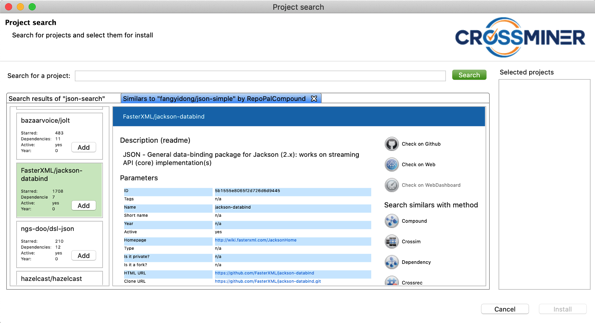

At this point, you can either import this library as an Eclipse project (see at the previous task) or you can import it as a Maven dependency.
## Import it as an Eclipse project
Please look at previous task.
## Import it as a Maven dependency
The GitHub readme file suggests how to import Jackson-core library as a Maven dependency (the GitHub page link is available in the details view of the project). 

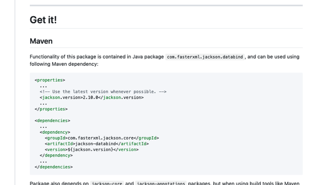

## Convert the example against the new library
In this particular case, we could use the readme file of this library because it provides some good examples which can be used to convert the previous example against the Jackson-core library. However, let’s assume we don’t have access to this information and we need to figure it out by ourselves.

- Create a new Eclipse project named openweather.jackson-core
- Configure > Convert to Maven project the created project
- Open the pom.xml file
- From the Dependencies tab, add a new dependency on **jackson-core** library:

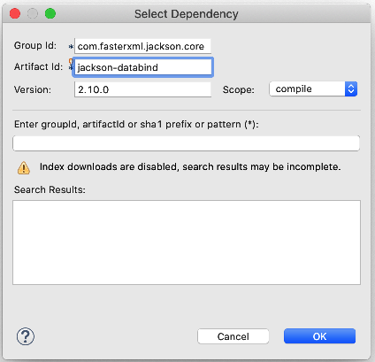

- The pom.xml file should look like that after the changes have been accepted:

	<project xmlns="http://maven.apache.org/POM/4.0.0" xmlns:xsi="http://www.w3.org/2001/XMLSchema-instance" xsi:schemaLocation="http://maven.apache.org/POM/4.0.0 http://maven.apache.org/xsd/maven-4.0.0.xsd">
	  <modelVersion>4.0.0</modelVersion>
	  <groupId>openweather.jackson-core</groupId>
	  <artifactId>openweather.jackson-core</artifactId>
	  <version>0.0.1-SNAPSHOT</version>
	  <build>
	    <sourceDirectory>src</sourceDirectory>
	    <plugins>
	      <plugin>
	        <artifactId>maven-compiler-plugin</artifactId>
	        <version>3.8.0</version>
	        <configuration>
	          <source>1.8</source>
	          <target>1.8</target>
	        </configuration>
	      </plugin>
	    </plugins>
	  </build>
	  <properties>
	  	<project.build.sourceEncoding>UTF-8</project.build.sourceEncoding>
	  </properties>
	  <dependencies>
	  	<dependency>
	  		<groupId>com.fasterxml.jackson.core</groupId>
	  		<artifactId>jackson-databind</artifactId>
	  		<version>2.10.0</version>
	  	</dependency>
	  </dependencies>
	</project>

- Create a class with its main method. Defines the list of objects that we would like to use in the import section of the class

	package openweather.jackson_core;
	
	import com.fasterxml.jackson.databind.JsonNode;
	import com.fasterxml.jackson.databind.ObjectMapper;
	
	public class App {
		public static void main(String[] args) {
			
		}
	}

- Select the whole code and, in the contextual menu, ask for relevant Q&A post recommendations. 

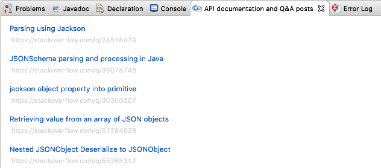

The first recommendation provides enough information to understand how to create and parse a JSON file using teh jackson-core library

Based on this, we can initiate our code accordingly and complete it by iterating through the ArrayNode weather

	package openweather.jackson_core;
	
	import java.io.IOException;
	import java.net.MalformedURLException;
	import java.net.URL;
	
	import com.fasterxml.jackson.databind.JsonNode;
	import com.fasterxml.jackson.databind.ObjectMapper;
	import com.fasterxml.jackson.databind.node.ArrayNode;
	
	public class App {
		static String OpenWeathermapAPI = "http://api.openweathermap.org/data/2.5/weather?q={city}&appid={appid}";
		static String AppId = "abbcea2020f75409af198b98de40e3a6";
	
		public static void main(String[] args) throws IOException {
			// Creation of the REST API
			String city = (args.length != 0)? args[0]:"Toulouse";
			String restAPI = OpenWeathermapAPI.replace("{city}", city);
			restAPI = restAPI.replace("{appid}", AppId);
			URL url = new URL(restAPI);
			// Call the  REST API
			ObjectMapper objectMapper = new ObjectMapper();
			JsonNode rootNode = objectMapper.readTree(url);
			String cityName = rootNode.get("name").asText();
			ArrayNode weather = (ArrayNode)rootNode.get("weather");
			for (JsonNode jsonNode : weather) {
				String description = jsonNode.get("description").asText();
				System.out.println(cityName+": "+description);
			}
		}
	}
	
# Other recommendations
## Library versions
The developer can check the library releases. Foreach imported library the system provides the list of versions.
- Select the Eclipse project to check for library release, for example the project **openweather.jackson-core**
- From the context menu, select the item **CROSSMINER > Search updates for libraries**

- The menu item opens a dialog listing all the jackson-core library versions:

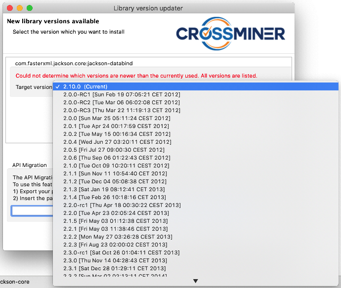

- In our case, we already had the latest release selected, otherwise we could select a more recent one and have our pom.xml file updated.

## Suggested library
The KB assists open source software developers in selecting suitable third-party libraries. CrossRec feature aims at supporting software developers who have already included some libraries in the new projects being developed, and expect to get recommendations on which additional libraries should be further incorporated (if any).
- Select the Eclipse project to check for library release, for example the project **openweather.jackson-core**
- From the context menu, select the item **CROSSMINER > Search libraries for this project**

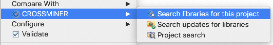

- The menu item opens a dialog listing the libraries that may be useful in our project because they are often used by other developers:

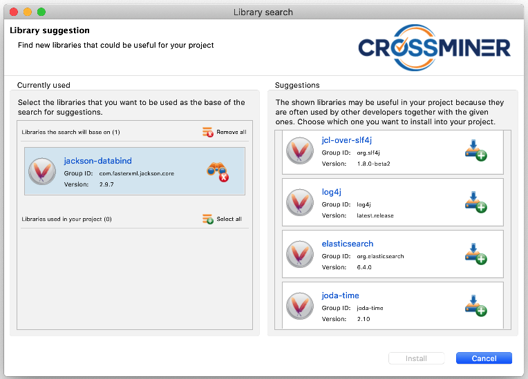

- Add, for example, the **log4j** logging library by clicking on the  button
- Press the Install button
- Accept the Confirmation box
- The selected library is inserted into the pom.xml dependency list

> - Unfortunately, the **last.release** keyword is not recognized anymore by Maven 3.+. It is for this reason it is shown as an error in the **pom.xml** file

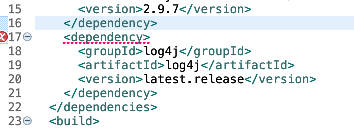

> - To fix it we must replace this keyword **latest.release** by the latest release version number. 
The portal <https://mvnrepository.com/artifact/log4j/log4j> indicates the version **2.1.17**

- At this point, the **pom.xml** should look like that:

	<?xml version="1.0"?>
	<project xsi:schemaLocation="http://maven.apache.org/POM/4.0.0 http://maven.apache.org/xsd/maven-4.0.0.xsd" xmlns="http://maven.apache.org/POM/4.0.0"
	    xmlns:xsi="http://www.w3.org/2001/XMLSchema-instance">
	  <modelVersion>4.0.0</modelVersion>
	  <groupId>openweather.jackson-core</groupId>
	  <artifactId>openweather.jackson-core</artifactId>
	  <version>0.0.1-SNAPSHOT</version>
	  <properties>
	    <project.build.sourceEncoding>UTF-8</project.build.sourceEncoding>
	  </properties>
	  <dependencies>
	    <dependency>
	      <groupId>com.fasterxml.jackson.core</groupId>
	      <artifactId>jackson-databind</artifactId>
	      <version>2.9.7</version>
	    </dependency>
	    <dependency>
	      <groupId>log4j</groupId>
	      <artifactId>log4j</artifactId>
	      <version>1.2.17</version>
	    </dependency>
	  </dependencies>
	  <build>
	    <sourceDirectory>src</sourceDirectory>
	    <plugins>
	      <plugin>
	        <artifactId>maven-compiler-plugin</artifactId>
	        <version>3.8.0</version>
	        <configuration>
	          <source>1.8</source>
	          <target>1.8</target>
	        </configuration>
	      </plugin>
	    </plugins>
	  </build>
	</project>

 
Now, the developer can adapt his code to use the logging library

# Some pointers
- The implemented tasks are available at: <https://github.com/md2manoppello/CROSSMINER_Tasks>
